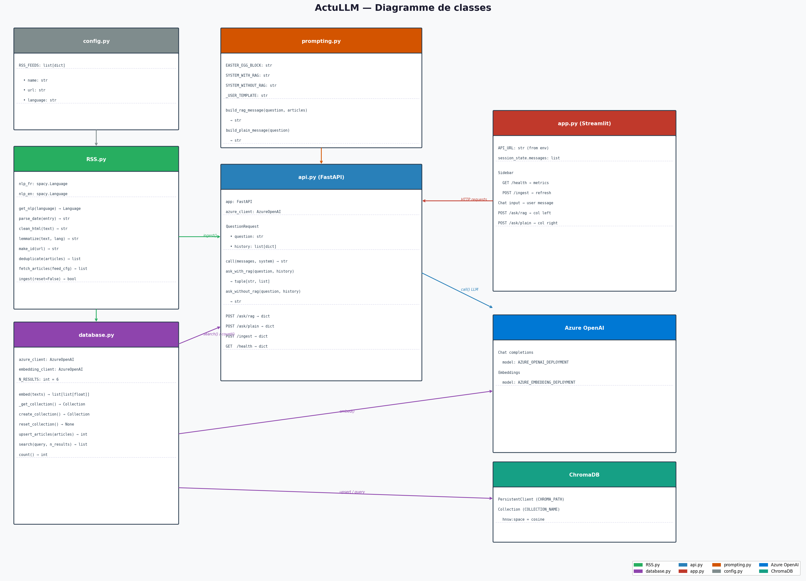

# Diagramme de classes

Ce diagramme représente l'ensemble des modules du projet, leurs attributs, leurs fonctions, et les appels entre eux.



---

## Lecture du diagramme

Chaque boîte représente un **module Python** (pas une classe au sens strict — ActuLLM utilise des modules avec des fonctions, pas de l'orienté objet pur).

Les sections dans chaque boîte sont organisées ainsi :

1. **Variables / constantes globales** — état partagé du module
2. **Fonctions** — liste des fonctions exposées avec leurs signatures
3. **Routes HTTP** (pour `api.py`) — endpoints FastAPI

### Conventions des flèches

| Couleur | Signification |
|---------|--------------|
| Gris foncé | `config.py` → `RSS.py` (import de RSS_FEEDS) |
| Vert | `RSS.py` → `database.py` (appel upsert à la fin de l'ingestion) |
| Violet | `database.py` → Azure OpenAI / ChromaDB |
| Orange | `prompting.py` → `api.py` (import des builders de prompt) |
| Bleu | `api.py` → Azure OpenAI (appel LLM) |
| Rouge | `app.py` → `api.py` (requêtes HTTP) |

---

## Vue des dépendances

```
config.py
    └── importé par RSS.py

RSS.py
    ├── utilise config.py (RSS_FEEDS)
    └── appelle database.py (create_collection, upsert_articles, reset_collection)

database.py
    ├── appelle Azure OpenAI Embeddings (embed)
    └── lit/écrit dans ChromaDB

prompting.py
    └── importé par api.py (build_rag_message, build_plain_message, SYSTEM_*)

api.py
    ├── importe database.py (search, count)
    ├── importe prompting.py
    ├── importe RSS.py (ingest)
    └── appelle Azure OpenAI Chat (call)

app.py
    └── appelle api.py via HTTP (requests)
```

!!! info "Aucune dépendance circulaire"
    Les dépendances sont strictement unidirectionnelles, ce qui facilite les tests et la maintenance.
